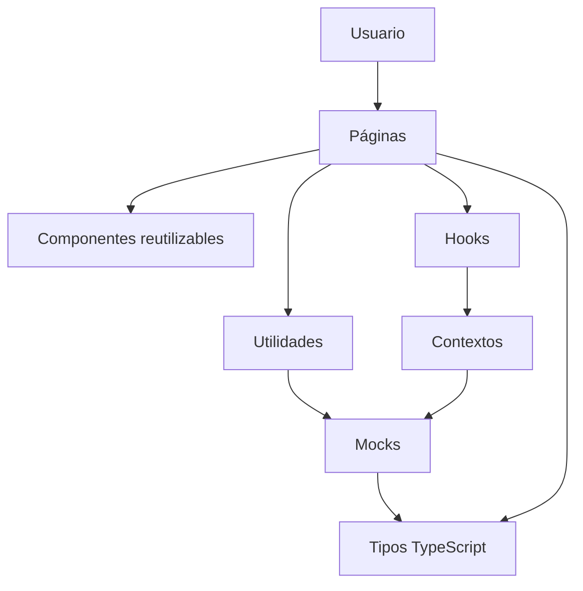
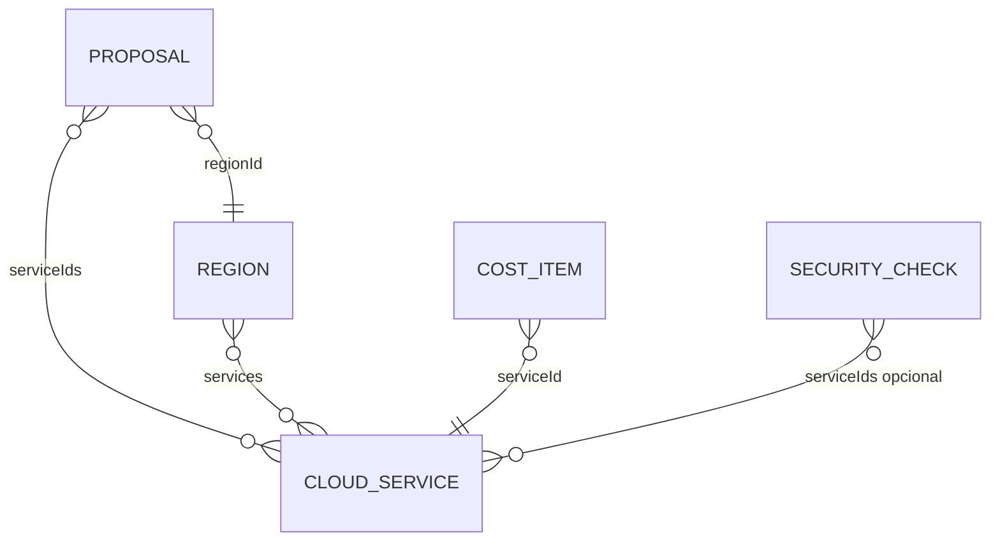
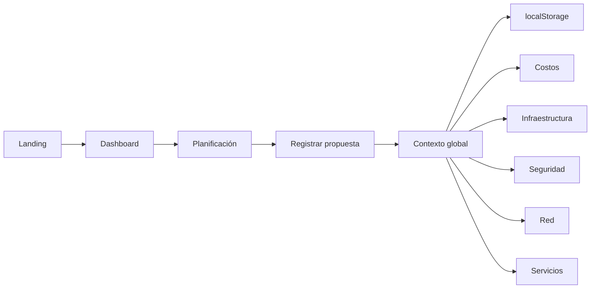

# Documentación de estudio — CloudOpus / CloudOps Dashboard

## 1. Introducción

Este proyecto es una aplicación web desarrollada para la práctica integrativa de **Cloud Foundations — Semanas 5 y 6**.

Su propósito es representar, mediante un frontend profesional, la planificación de una solución basada en servicios de AWS. La aplicación no crea infraestructura real ni consume una cuenta de AWS. Utiliza datos simulados para explicar visualmente conceptos de:

- Planificación Cloud.
- Servicios AWS.
- Economía y estimación de costos.
- Infraestructura global.
- Seguridad e IAM.
- Responsabilidad compartida.
- Arquitectura de red y VPC.

La interfaz utiliza actualmente la marca visual **CloudOpus**, mientras que el nombre solicitado en la práctica es **CloudOps Dashboard**.

---

## 2. Problema que resuelve

Antes de desplegar una aplicación empresarial en AWS, una organización necesita responder preguntas como:

- ¿Qué servicios se utilizarán?
- ¿En qué región se desplegará la solución?
- ¿Cuánto podría costar mensualmente?
- ¿Qué nivel de disponibilidad se necesita?
- ¿Qué controles de seguridad deben revisarse?
- ¿Cómo se conectan Internet, DNS, CDN, VPC, servidores y base de datos?

CloudOpus centraliza esta información en una SPA —Single Page Application— y permite registrar diferentes propuestas para compararlas y analizarlas.

---

## 3. Alcance

### Incluido

- Registro de propuestas Cloud.
- Persistencia local de propuestas.
- Selección global de propuesta.
- Catálogo de servicios AWS.
- Estimación y simulación de costos.
- Mapa mundial de regiones.
- Controles de seguridad relacionados con los servicios.
- Matriz de responsabilidad compartida.
- Arquitectura visual de red.
- Tema claro y oscuro.
- Gráficos y componentes reutilizables.

### No incluido

- Backend.
- Base de datos remota.
- Autenticación real.
- Administración de usuarios.
- Conexión con AWS Cost Explorer.
- Despliegue real de EC2, RDS, VPC u otros recursos.
- Datos en tiempo real.

El uso de mocks está permitido por el PDF de la práctica.

---

## 4. Tecnologías

| Tecnología | Función |
|---|---|
| React 19 | Construcción de la interfaz por componentes |
| TypeScript | Tipado del dominio y detección temprana de errores |
| Vite | Servidor de desarrollo y generación del build |
| Tailwind CSS 4 | Estilos, responsive y temas |
| React Router 7 | Navegación entre módulos |
| Lucide React | Iconografía |
| Recharts | Gráficos de costos |
| React Simple Maps | Mapa mundial y marcadores geográficos |
| TopoJSON | Geometría local de países |
| Vitest | Pruebas de consistencia de mocks |
| Oxlint | Análisis estático del código |

---

## 5. Instalación y comandos

```bash
npm install
npm run dev
```

Comandos de control:

```bash
npm run lint   # analiza problemas de código
npm test       # ejecuta pruebas de consistencia
npm run build  # valida TypeScript y genera producción
npm audit      # revisa vulnerabilidades de dependencias
```

---

## 6. Arquitectura general

La aplicación sigue una arquitectura sencilla separada por responsabilidad:



No es Clean Architecture ni una arquitectura hexagonal. Es una estructura apropiada para un frontend académico de tamaño pequeño o mediano.

### Responsabilidad de cada capa

- `pages`: organiza cada módulo y conecta datos con componentes.
- `components`: contiene elementos reutilizables de presentación.
- `context`: mantiene estado compartido.
- `hooks`: ofrece acceso controlado a los contextos.
- `data`: contiene los datos simulados.
- `types`: define contratos del dominio.
- `utils`: centraliza cálculos y reglas compartidas.
- `routes`: define navegación y carga diferida.

---

## 7. Estructura del proyecto

```text
src/
├── assets/                 Imágenes del proyecto
├── components/
│   ├── CostCard.tsx
│   ├── CostChart.tsx
│   ├── Header.tsx
│   ├── Loader.tsx
│   ├── ProposalForm.tsx
│   ├── ProposalList.tsx
│   ├── RegionCard.tsx
│   ├── SecurityCard.tsx
│   ├── ServiceCard.tsx
│   ├── Sidebar.tsx
│   ├── StatCard.tsx
│   ├── StatusBadge.tsx
│   └── WorldMap.tsx
├── context/
│   ├── ProposalsContext.tsx
│   ├── ThemeContext.tsx
│   ├── proposals-context.ts
│   └── theme-context.ts
├── data/
│   ├── awsServices.ts
│   ├── costs.ts
│   ├── dataConsistency.test.ts
│   ├── hardware.ts
│   ├── network.ts
│   ├── planning.ts
│   ├── regions.ts
│   └── security.ts
├── hooks/
│   ├── useProposals.ts
│   └── useTheme.ts
├── pages/
│   ├── Contacto.tsx
│   ├── Costs.tsx
│   ├── Dashboard.tsx
│   ├── Infrastructure.tsx
│   ├── Landing.tsx
│   ├── Network.tsx
│   ├── NotFound.tsx
│   ├── Planning.tsx
│   ├── Security.tsx
│   ├── Services.tsx
│   └── SobreNosotros.tsx
├── routes/
│   ├── AppRouter.tsx
│   └── routes.ts
├── types/cloud.ts
├── utils/
│   ├── cloudData.ts
│   ├── format.ts
│   ├── geo.test.ts
│   └── geo.ts
├── App.tsx
├── index.css
└── main.tsx
```

El archivo geográfico se encuentra en:

```text
public/maps/countries-110m.json
```

---

## 8. Inicio de la aplicación

El flujo inicial es:

```text
index.html
   ↓
src/main.tsx
   ↓
src/App.tsx
   ↓
src/routes/AppRouter.tsx
```

`main.tsx` crea la raíz de React y renderiza `App` dentro de `StrictMode`.

`App.tsx` delega la aplicación al router.

`AppRouter.tsx` instala:

- `BrowserRouter`.
- `ThemeProvider`.
- `ProposalsProvider`.
- Rutas públicas.
- Layout privado con Sidebar.
- Página 404.

---

## 9. Navegación y lazy loading

Las rutas principales están en `src/routes/routes.ts`:

| Ruta | Página |
|---|---|
| `/dashboard` | Dashboard |
| `/planning` | Planificación |
| `/costs` | Costos |
| `/infrastructure` | Infraestructura |
| `/security` | Seguridad |
| `/network` | Red |
| `/services` | Servicios |

Cada módulo utiliza `React.lazy`.

Esto significa que el navegador descarga el código de una página solamente cuando se visita. `Suspense` muestra el componente `Loader` durante la carga.

Ventajas:

- Menor bundle inicial.
- Inicio más rápido.
- Separación natural por módulo.

---

## 10. Estado global de propuestas

El estado se administra en `ProposalsContext.tsx`.

El contexto expone:

```ts
interface ProposalsContextValue {
  proposals: Proposal[]
  selectedProposalId: string
  setSelectedProposalId: (id: string) => void
  addProposal: (proposal: Proposal) => void
  resetProposals: () => void
}
```

### Razón del estado global

La misma propuesta debe permanecer seleccionada al pasar de Dashboard a Costos, Infraestructura, Seguridad, Red o Servicios.

Si cada página utilizara su propio `useState`, la selección se perdería o sería diferente en cada módulo.

### Hook

Las páginas no consumen directamente el contexto. Utilizan:

```ts
const {
  proposals,
  selectedProposalId,
  setSelectedProposalId,
} = useProposals()
```

El hook comprueba que exista un `ProposalsProvider` y produce un error descriptivo si se usa fuera de él.

---

## 11. Persistencia y validación

Las propuestas se guardan en:

```text
cloudopus:proposals:v1
```

Estructura almacenada:

```ts
interface StoredProposals {
  version: 1
  proposals: Proposal[]
  selectedProposalId: string
}
```

### Validaciones aplicadas

Antes de aceptar datos de `localStorage`, el sistema comprueba:

- Que el valor sea un objeto válido.
- Que la región exista.
- Que los servicios existan.
- Que los servicios estén disponibles en la región.
- Que el nombre no esté vacío.
- Que la cantidad de usuarios sea mayor que cero.
- Que la disponibilidad sea válida.
- Que existan objetivo de migración y fecha.

Los datos corruptos se descartan y se cargan las propuestas iniciales.

También existe migración desde la clave anterior:

```text
cloudopus:proposals
```

---

## 12. Tema claro y oscuro

`ThemeProvider` controla:

```ts
type Theme = 'light' | 'dark'
```

La preferencia se guarda en:

```text
cloudopus:theme
```

Prioridad inicial:

1. Tema almacenado.
2. Preferencia del sistema operativo mediante `prefers-color-scheme`.
3. Tema claro.

El modo oscuro se activa agregando la clase `dark` al elemento `<html>`.

Los botones Luna/Sol están disponibles en Landing y Sidebar.

---

## 13. Modelo de datos

Los contratos se encuentran en `src/types/cloud.ts`.

### CloudService

Representa un servicio AWS:

```ts
interface CloudService {
  id: string
  name: string
  category: ServiceCategory
  description: string
  mainFunction: string
  status: 'active' | 'idle'
}
```

Los costos no se almacenan aquí para evitar duplicidad.

### CostItem

Representa una línea de costo:

```ts
interface CostItem {
  id: string
  serviceId: string
  serviceName: string
  quantity: number
  unit: string
  unitCost: number
  unitCostLabel: string
  monthlyCost: number
  scalesWithUsers: boolean
}
```

### Region

```ts
interface Region {
  id: string
  name: string
  location: string
  services: string[]
  status: 'active' | 'standby'
  priceFactor: number
  lat: number
  lng: number
}
```

- `services` indica qué servicios están configurados en esa región.
- `priceFactor` multiplica los precios base (Virginia = 1.00) para regionalizar costos.
- `lat` y `lng` ubican la región en el mapa y en la geolocalización.

### Proposal

```ts
interface Proposal {
  id: string
  solutionName: string
  appType: string
  description: string
  regionId: string
  estimatedUsers: number
  availability: '99%' | '99.9%' | '99.99%'
  serviceIds: string[]
  migrationGoal: string
  createdAt: string
}
```

### SecurityCheck

Un control puede aplicarse a todos los proyectos o solamente a determinados servicios mediante `serviceIds`.

### NetworkNode y NetworkEdge

- `NetworkNode`: componente de la arquitectura.
- `NetworkEdge`: conexión entre dos nodos.

### ResponsibilityItem

Representa una responsabilidad del modelo compartido:

```ts
interface ResponsibilityItem {
  id: string
  task: string
  owner: 'AWS' | 'Cliente' | 'Compartido'
  layer: string
}
```

### HardwareTier y ServiceHardware

Definen los tiers de instancia por servicio (EC2, RDS y ElastiCache, todos basados en usuarios):

```ts
interface HardwareTier {
  instanceType: string
  minUsers: number
  minStorageGb: number
  vcpus: number
  ramGb: number
  note: string
}

interface ServiceHardware {
  serviceId: string
  serviceName: string
  dimension: 'users' | 'storage'
  tiers: HardwareTier[]
}
```

---

## 14. Relaciones entre datos



Reglas principales:

- Una propuesta pertenece a una región.
- Una propuesta utiliza varios servicios.
- Una región habilita varios servicios.
- Cada línea de costo corresponde a un servicio.
- Algunos controles de seguridad dependen de servicios concretos.

---

## 15. Utilidades de dominio

`src/utils/cloudData.ts` evita repetir lógica.

### getRegionFactor

Devuelve el factor de precio de una región (1 por defecto si no se pasa región).

### getServiceCost

Busca el costo de un servicio y, si recibe una región, aplica el `priceFactor` correspondiente.

### getMonthlyCost

Suma el costo mensual de una lista de identificadores, regionalizado si se pasa la región.

### recommendTier

Selecciona la instancia de hardware recomendada según los usuarios proyectados. Todos los servicios (EC2, RDS, ElastiCache) usan `minUsers` como criterio.

### Geografía

`src/utils/geo.ts` contiene `haversineKm` y `findNearestRegion`, que calculan la región más cercana a una coordenada.

### getValidServicesForProposal

Devuelve únicamente servicios que:

1. Fueron seleccionados en la propuesta.
2. Existen en el catálogo.
3. Están disponibles en la región.

### getSecurityChecksForProposal

Filtra controles según los servicios seleccionados.

### summarizeSecurity

Cuenta estados `ok`, `warning` y `error`.

### countServicesInRegion

Calcula servicios únicos desplegados por todas las propuestas de una región.

---

## 16. Módulo Dashboard

Archivo: `src/pages/Dashboard.tsx`.

Responsabilidades:

- Seleccionar propuesta.
- Obtener región y servicios.
- Calcular costo mensual y anual.
- Mostrar estado de arquitectura.
- Resumir seguridad.
- Mostrar costo por servicio en un gráfico.
- Mostrar regiones y servicios desplegados.

Fórmulas:

```ts
monthlyCost = sum(selectedCostItems.monthlyCost)
annualCost = monthlyCost * 12
```

La arquitectura se considera:

- `Operativa` si la región está activa.
- `En revisión` si está en standby.

### Exportación PDF

El botón "Exportar PDF" (ubicado en el header, al nivel del selector de propuestas) genera un documento PDF con toda la información actual del dashboard:

- **Encabezado:** título del documento y fecha de generación.
- **Propuesta seleccionada:** nombre, tipo, objetivo de migración y descripción.
- **Tabla de KPIs:** servicios utilizados, región, estado de arquitectura, disponibilidad, usuarios estimados, costos mensual/anual y estado de seguridad.
- **Tabla de desglose de costos por servicio:** cantidad, tarifa, costo mensual y anual, con fila de totales.
- **Tabla de controles de seguridad:** título, área, estado (con colores) y descripción.
- **Tabla de regiones AWS:** nombre, ubicación, estado, cantidad de servicios desplegados y factor de precio.
- **Pie de página:** nombre de la propuesta y paginación en cada hoja.

El nombre del archivo se deriva del nombre de la propuesta (ej: `dashboard-portal-empresarial-andina.pdf`).

jsPDF y jspdf-autotable se cargan bajo demanda con `import()` dinámico para mantener el bundle del Dashboard liviano (11.7 KB).

---

## 17. Módulo Planificación

Archivo: `src/pages/Planning.tsx`.

Utiliza tres pestañas:

- Registradas.
- Registrar.
- Servicios.

### ProposalForm

Valida:

- Nombre obligatorio.
- Usuarios mayores a cero.
- Al menos un servicio.

Al cambiar de región, elimina servicios incompatibles.

El costo previo se calcula con:

```ts
getMonthlyCost(serviceIds)
```

### ProposalList

Presenta las propuestas almacenadas, incluyendo región, disponibilidad, usuarios, objetivo y servicios.

### Restablecer datos

Recupera las propuestas iniciales de los mocks.

---

## 18. Módulo Costos

Archivo: `src/pages/Costs.tsx`.

Ofrece:

- Resumen por hora, día, semana, mes y año.
- Costo mensual y anual.
- Costo por usuario.
- Desglose por servicio.
- Distribución por categoría.
- Simulador por cantidad de usuarios.
- Recomendaciones de gasto.

### Periodos

Los datos base son mensuales y se convierten mediante factores:

```text
Hora   = mensual / 730
Día    = mensual × 24 / 730
Semana = mensual × 168 / 730
Mes    = mensual
Año    = mensual × 12
```

### Simulación

Servicios variables (escalan con usuarios):

- EC2.
- S3.
- RDS.
- CloudFront.
- Lambda.
- ElastiCache.
- SQS.
- SNS.

Servicios fijos:

- Route 53.
- VPC.
- IAM.
- CloudWatch.
- KMS.

```ts
scale = projectedUsers / baseUsers

simulatedCost = variable
  ? monthlyCost * scale
  : monthlyCost
```

La simulación es educativa; no representa la fórmula oficial de precios de AWS.

**Derivación automática de hardware:**

Al cambiar los usuarios proyectados, el sistema calcula automáticamente:
- **vCPU y RAM:** según los tiers de hardware recomendados (EC2, RDS, ElastiCache).
- **Storage (GB):** `Math.max(100, Math.ceil(users / 1000) * 50)` — mínimo 100 GB, incrementa 50 GB por cada 1000 usuarios.

Ya no existe un control manual de almacenamiento; todo se deriva de los usuarios proyectados.

---

## 19. Módulo Infraestructura Global

Archivo: `src/pages/Infrastructure.tsx`.

Muestra:

- Región principal.
- Estado regional.
- Servicios desplegados.
- Disponibilidad objetivo.
- Mapa mundial.
- Regiones configuradas.
- Servicios de la propuesta.

### WorldMap

Utiliza:

- React Simple Maps.
- Proyección Equal Earth.
- TopoJSON local.
- Coordenadas reales aproximadas.
- Zoom y desplazamiento.
- Rutas entre regiones con propuestas.

Coordenadas configuradas:

- Oregón.
- Norte de Virginia.
- São Paulo.
- Irlanda.
- Singapur.
- Tokio.

---

## 20. Módulo Seguridad

Archivo: `src/pages/Security.tsx`.

Cumple con los conceptos solicitados:

| Área | Ejemplo |
|---|---|
| Cuentas | MFA del usuario raíz |
| IAM | Rotación de claves y mínimo privilegio |
| Datos | Cifrado S3 y respaldos RDS |
| Cumplimiento | CloudTrail |
| Responsabilidad compartida | Matriz AWS/Cliente |

Estados:

- Verde: correcto.
- Amarillo: requiere revisión.
- Rojo: problema.

### Puntuación

```ts
score = (ok + warning * 0.5) / total * 100
```

Una advertencia aporta la mitad de valor que un control correcto.

### Responsabilidad compartida

AWS se encarga de la seguridad **de** la nube, por ejemplo:

- Centros de datos.
- Hardware.
- Red física.
- Hipervisor.

El cliente se encarga de la seguridad **en** la nube, por ejemplo:

- Datos.
- IAM.
- Sistema operativo invitado.
- Configuración de recursos.

---

## 21. Módulo Arquitectura de Red

Archivo: `src/pages/Network.tsx`.

Representa:

```text
Internet
   ↓ DNS
Route 53
   ↓ Enrutamiento
CloudFront
   ↓ HTTPS
VPC 10.0.0.0/16
   ├── Subred pública: EC2 Auto Scaling
   └── Subred privada: RDS Multi-AZ, puerto 5432
```

### Conceptos

- **Route 53:** resolución DNS.
- **CloudFront:** distribución global y reducción de latencia.
- **VPC:** red virtual aislada.
- **Subred pública:** puede recibir tráfico mediante rutas controladas.
- **Subred privada:** protege recursos como bases de datos.
- **Security Group:** controla puertos y orígenes permitidos.
- **Multi-AZ:** mejora disponibilidad ante fallos de zona.

Los servicios no seleccionados permanecen visibles pero atenuados. Así se conserva la arquitectura de referencia y se diferencia lo realmente incluido.

---

## 22. Módulo Servicios AWS

Archivo: `src/pages/Services.tsx`.

Cada tarjeta muestra:

- Nombre.
- Categoría.
- Función principal.
- Descripción.
- Estado en la propuesta.
- Costo mensual simulado.
- Cantidad de regiones configuradas.

### Servicios incluidos

#### EC2

Máquinas virtuales para ejecutar backend, APIs y procesos. Puede trabajar con Auto Scaling.

#### S3

Almacenamiento de objetos para archivos, imágenes, logs y respaldos.

#### RDS

Base de datos relacional administrada con respaldos y Multi-AZ.

#### IAM

Identidades, roles, usuarios y políticas de acceso.

#### VPC

Red virtual aislada para organizar subredes, rutas y gateways.

#### Route 53

Servicio DNS que relaciona dominios con recursos AWS.

#### CloudFront

CDN global para reducir latencia y descargar tráfico del origen.

#### Lambda

Cómputo serverless que ejecuta código en respuesta a eventos sin administrar servidores.

#### ElastiCache

Caché en memoria (Redis/Memcached) para acelerar consultas frecuentes y sesiones.

#### SQS

Cola de mensajes administrada para desacoplar componentes y procesar tareas asíncronas.

#### SNS

Notificaciones y mensajería pub/sub para distribuir eventos a múltiples destinos.

#### CloudWatch

Monitoreo y observabilidad con métricas, logs, alarmas y dashboards personalizables.

#### KMS

Servicio administrado para crear y controlar claves de cifrado de datos.

---

## 23. Componentes reutilizables

### Sidebar

- Navega entre módulos.
- Marca la ruta activa.
- Se expande y colapsa.
- Cambia el tema.
- Regresa al Landing.

### StatCard

Presenta título, valor, subtítulo e icono. Incluye variante invertida.

### CostCard

Presenta cantidad, tarifa de referencia y subtotal del periodo.

### CostChart

Gráfico de barras responsive construido con Recharts.

### ServiceCard

Presenta información general de un servicio AWS.

### SecurityCard

Presenta control, área, descripción y estado.

### RegionCard

Presenta región, ubicación, estado y cantidad de servicios.

### StatusBadge

Unifica indicadores `ok`, `warning` y `error`.

### WorldMap

Mapa geográfico interactivo con regiones y rutas.

---

## 24. Diseño visual

El sistema utiliza tokens en `src/index.css`.

Principales familias:

- `brand`: azul pizarra.
- `canvas`: fondo general.
- `surface`: cards y paneles.
- `foreground`: texto principal.
- `muted`: texto secundario.
- `subtle`: bordes.

Patrón de card:

```text
rounded-2xl
border
bg-white
p-5 o p-6
shadow-sm
```

Estados semánticos:

- Emerald: correcto.
- Amber: advertencia.
- Rose: error.

---

## 25. Pruebas

Archivo: `src/data/dataConsistency.test.ts`.

Comprueba:

1. Identificadores únicos.
2. Costos relacionados con servicios existentes.
3. Servicios regionales válidos.
4. Propuestas compatibles con sus regiones.
5. Aristas entre nodos de red existentes.

Estas pruebas evitan que los mocks se desincronicen.

Ejemplo de error que detectarían:

```ts
proposal.serviceIds = ['servicio-inexistente']
```

---

## 26. Conceptos React utilizados

### Componentes

Funciones que retornan JSX y encapsulan interfaz y comportamiento.

### Props

Datos enviados de un componente padre a uno hijo.

### Estado local

Se utiliza para pestañas, periodos, formularios, simulador y zoom.

### Context

Se utiliza cuando varias páginas necesitan compartir propuestas o tema.

### Hooks

- `useState`: estado local.
- `useEffect`: sincronización con almacenamiento o DOM.
- `useContext`: acceso a contextos.
- Hooks personalizados: `useProposals`, `useTheme`.

### Renderizado condicional

Permite mostrar estados vacíos, componentes incluidos y controles aplicables.

### Listas y keys

Los servicios, regiones y propuestas se generan con `.map()` y claves estables.

---

## 27. Conceptos TypeScript utilizados

- Interfaces para entidades.
- Uniones literales para estados y disponibilidad.
- Props tipadas.
- `Record` para mapas de configuración.
- Tipos opcionales.
- Narrowing mediante validaciones.
- Imports exclusivos de tipos con `import type`.

Ventajas:

- Evita estados inválidos.
- Mejora autocompletado.
- Documenta contratos.
- Facilita refactorizaciones.

---

## 28. Flujo completo de uso



1. El usuario entra desde Landing.
2. Consulta el Dashboard.
3. Registra una propuesta.
4. El contexto valida y guarda la propuesta.
5. La propuesta queda seleccionada globalmente.
6. Todos los módulos muestran información relacionada.

---

## 29. Limitaciones conocidas

- Los costos son educativos y estáticos.
- No existe autenticación real.
- “Cerrar sesión” solamente regresa al Landing.
- No se consumen APIs de AWS.
- La seguridad es una simulación, no un escaneo.
- Las regiones y servicios son un subconjunto académico.
- El Sidebar está orientado principalmente a escritorio.
- `Header.tsx` permanece como placeholder y no forma parte activa del layout.
- No existe edición o eliminación individual de propuestas.

---

## 30. Preguntas para estudiar

### Arquitectura

1. ¿Por qué los mocks están separados de las páginas?
2. ¿Qué problema resuelve `cloudData.ts`?
3. ¿Por qué la propuesta seleccionada debe ser global?
4. ¿Qué beneficio ofrece lazy loading?
5. ¿Por qué los costos no están dentro de `CloudService`?

### React

1. ¿Cuál es la diferencia entre props, estado y contexto?
2. ¿Cuándo se ejecuta un `useEffect`?
3. ¿Qué función cumple `Suspense`?
4. ¿Por qué cada elemento de una lista necesita `key`?
5. ¿Qué ventaja tienen los hooks personalizados?

### Cloud

1. ¿Cuál es la diferencia entre EC2 y RDS?
2. ¿Por qué RDS debería estar en una subred privada?
3. ¿Cuál es la función de Route 53?
4. ¿Qué ventaja ofrece CloudFront?
5. ¿Qué diferencia existe entre región y zona de disponibilidad?
6. ¿Qué significa responsabilidad compartida?
7. ¿Por qué IAM debe aplicar mínimo privilegio?
8. ¿Qué significa Multi-AZ?

### Costos

1. ¿Por qué algunos costos escalan con usuarios y otros no?
2. ¿Por qué el simulador no equivale a AWS Pricing Calculator?
3. ¿Cómo se calcula el costo anual?
4. ¿Qué estrategias pueden reducir EC2, RDS y S3?

---

## 31. Respuestas rápidas para exposición

### ¿Por qué React?

Porque permite dividir una interfaz compleja en componentes reutilizables, administrar estado y actualizar únicamente las partes necesarias.

### ¿Por qué TypeScript?

Porque define contratos para propuestas, servicios, costos y regiones, reduciendo errores entre mocks y componentes.

### ¿Por qué localStorage?

Porque la práctica no exige backend y localStorage permite demostrar persistencia entre recargas.

### ¿Por qué Context?

Porque todos los módulos necesitan conocer la misma lista y la misma propuesta seleccionada.

### ¿Por qué una VPC?

Porque permite aislar la red, organizar subredes y controlar la comunicación entre recursos públicos y privados.

### ¿Por qué CloudFront antes de la VPC?

Porque distribuye contenido desde ubicaciones cercanas al usuario, reduce latencia y disminuye carga sobre el origen.

### ¿Cómo se protege RDS?

Ubicándolo en una subred privada, permitiendo acceso únicamente desde la aplicación y habilitando respaldos y Multi-AZ.

---

## 32. Ruta recomendada de estudio

1. Leer `types/cloud.ts` para conocer el dominio.
2. Revisar `data/` para entender los mocks.
3. Estudiar `utils/cloudData.ts` para comprender reglas.
4. Revisar `ProposalsContext.tsx` y `useProposals.ts`.
5. Leer `AppRouter.tsx` y `routes.ts`.
6. Estudiar Planificación y Dashboard.
7. Continuar con Costos e Infraestructura.
8. Finalizar con Seguridad, Red y Servicios.
9. Ejecutar tests y provocar temporalmente un dato inválido para observar la validación.

---

## 33. Conclusión

CloudOpus demuestra cómo representar conceptos de Cloud Foundations mediante una aplicación React organizada, reutilizable y visual. El valor principal del proyecto no está en desplegar AWS, sino en modelar correctamente una solución, relacionar sus componentes y presentar decisiones técnicas de forma comprensible.

La aplicación integra planificación, costos, regiones, seguridad, responsabilidad compartida, red y servicios AWS dentro de una sola experiencia coherente.

---

## 34. Funcionalidades agregadas (iteración 2)

Estas funciones amplían el alcance académico sin salir del PDF:

### Precios por región

- Cada `Region` tiene `priceFactor` (Virginia = 1.00 como base; São Paulo = 1.21, Singapur = 1.09, Tokio = 1.10, etc.).
- `getServiceCost(serviceId, regionId?)` y `getMonthlyCost(serviceIds, regionId?)` aplican el factor.
- Costos, Dashboard, Propuesta y Servicios muestran precios regionalizados (con una nota "Precios de X · factor ×Y").
- Se agregaron dos regiones: **Singapur** (`ap-southeast-1`) y **Tokio** (`ap-northeast-1`), con coordenadas para mapa y geolocalización.

### Tipos de aplicación y servicios recomendados

- `appTypes` ampliado a 8 tipos (incluidos IA/ML, Streaming e IoT).
- `recommendedServices` mapea cada tipo a servicios recomendados.
- En el formulario, los recomendados se marcan "Sugerido" y un botón "Usar recomendados" los añade sin pisar la selección manual. Siempre se filtran por lo disponible en la región elegida.

### Modelo de responsabilidad compartida

- `ResponsibilityItem` ganó `layer`.
- Seguridad muestra una matriz de tres columnas (AWS "de la nube" / Cliente "en la nube" / Compartido) agrupada por capa: física, red, plataforma, datos, aplicación, identidades y configuración.

### Detalle de cambio de hardware

- `data/hardware.ts` define tiers: EC2 por usuarios (`t3.medium → t3.large → m5.large → m5.xlarge`) y RDS por almacenamiento (`db.m6g.large → db.m6g.xlarge → db.m6g.2xlarge`).
- El simulador de Costos incluye un slider de almacenamiento y un panel "Hardware recomendado" con el salto de instancia.
- S3 se documenta como almacenamiento serverless (no cambia de hardware).

### Geolocalización

- `utils/geo.ts` implementa haversine y `findNearestRegion`.
- El botón "Usar mi ubicación" del formulario auto-selecciona la región activa más cercana y muestra la distancia; con fallback si el navegador deniega el permiso.

### Borrar datos

- `clearProposals()` en `ProposalsContext` vacía las propuestas y persiste el estado vacío.
- `getInitialState` confía en un payload v1 incluso vacío, de modo que el estado limpio se mantiene tras recargar.
- Botón "Borrar datos" en Planificación (junto a "Restablecer datos").
